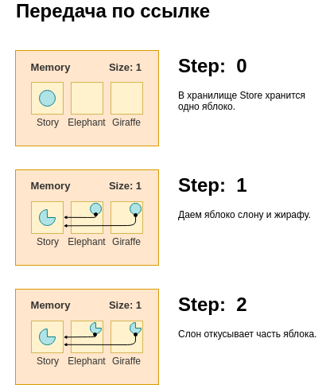

# Система типов, тип данных, значимые и ссылочные типы

## Экскурс в типизацию - Система Типов, Тип Данных, Значимые\Ссылочные Типы

В зависимости от среды выполнения, операции над данными могут быть ограничены некими правилами. Для каждого конкретного вида данных декларируются конкретные правила. В роли конкретного свода правил выступает тип данных.

Среда выполнения, в которой отсутствует классификация данных и ограничения на операции над ними, не имеет типов. Поэтому такую среду выполнения справедливо называть не типизированной. И наоборот, среду выполнения, которая классифицирует данные и операции над ними, справедливо называть типизированной.

В основе любой типизированной среды выполнения, лежит такое фундаментальное понятие, как система типов. Сложно сформулировать исчерпывающие определение термину система типов, затронув все аспекты, все значения, которые вкладывают в этот термин разработчики из различных областей.

## Система Типов

*Система Типов* - это совокупность правил, назначающих свойства, называемые типами, различным конструкциям, составляющим программу. Обычно, к конструкциям нуждающихся в аннотации типов, относятся - переменные, поля и свойства объекта, а также параметры и возвращаемое функцией значение.

В основе системы типов любого языка программирования всегда лежит базисная система типов встроенных в язык. К базисным или встроенным типам данных, относятся такие типы, как - `byte`, `int`, `string`, `boolean`, `object` и им подобные. На основе этих типов, среда выполнения, а также разработчик определяют типы данных более высокого уровня - `Date`, `Array` и т.д.

## Тип данных (тип)

Понятие *тип данных* является фундаментальным понятием теории программирования. Тип данных (или просто тип) - это характеристика данных, которая определяет множество значений и операций, которые могут быть выполнены над этими данными.

Простыми словами, тип данных, в зависимости от языка программирования, может хранить информацию о членах, к которым относятся поля, свойства.  методы и д.р. О том, в каком месте, в *стеке* (stack) или *куче* (heap) будет выделятся память во время выполнения программы, а также её объем. В каких операциях (как например сложение `+`, умножение `*`, присваивание `=` и т.д.)  может участвовать тип данных.

Типы Данных делятся на два вида - *типы значения* (его ещё называют *значимым типом*) (value type), которые хранят значение и *ссылочные типы* (reference types), которые хранят ссылку на значение.

При операции присваивания значения, принадлежащего к значимому типу, данные копируются-дублируются в памяти. При операции присваивания значения принадлежащему к ссылочным типам, копируется лишь ссылка на данные.

## Тип данных передающийся по значению (примитивный тип)

Когда переменная, ассоциированная со значением, принадлежащим к значимому типу данных, участвует в операции присвоения, то операнд из левой части будет ассоциирован не с значением правого операнда, а с его копией. Другими словами, значение будет дублировано в памяти и переменные будут ассоциированы с разными значениями - участками памяти. При изменении любой переменной своего значения, значения других переменных затронуто не будет.

  

Обычно говорят, что переменные с типом значения хранят значение и передаются по значению.

## Тип данных передающийся по ссылке

В случае, когда переменная, ассоциированная с ссылочным типом данных, участвует в операции присваивания, то операнду из левой части будет присвоена ссылка на значение, с которым ассоциирован операнд из правой части. Другими словами обе переменные будут ассоциированы с одним и тем же значением - участком памяти. При изменении значения любой переменной, изменения затронут все переменные ассоциированные с этим значением.

 

Обычно говорят, что переменные ссылочного типа ссылаются на значение или разделяют значение.

## Итоги

Подведем итоги - 

- Системой Типов - называется совокупность правил, назначающих свойства, называемые типами, различным конструкциям, составляющим программу, чья база, позволяет среде выполнения и разработчику определять типы данных более высокого уровня.
- Тип данных (или просто тип) - это характеристика данных, которая определяет множество значений и операций, которые могут быть выполнены над этими значениями.
- Типы данных разделяются на - типы значения и ссылочные типы.
- Типы значения передаются по значению, при этом выделяется дополнительная память.
- Ссылочные типы передаются с помощью ссылок на участок памяти хранящий данные.
