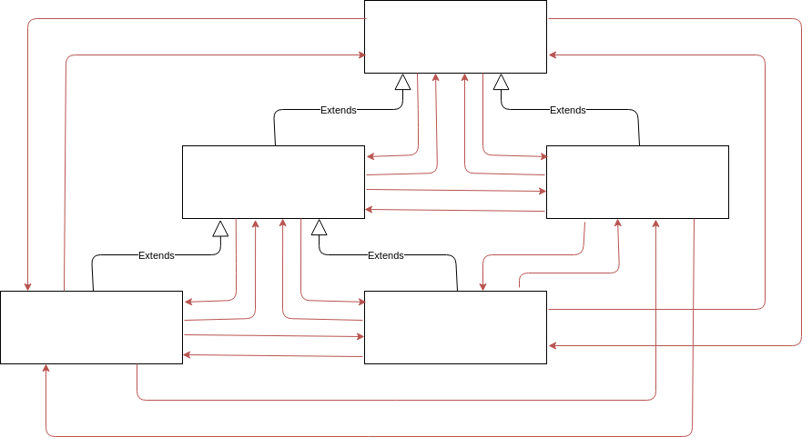
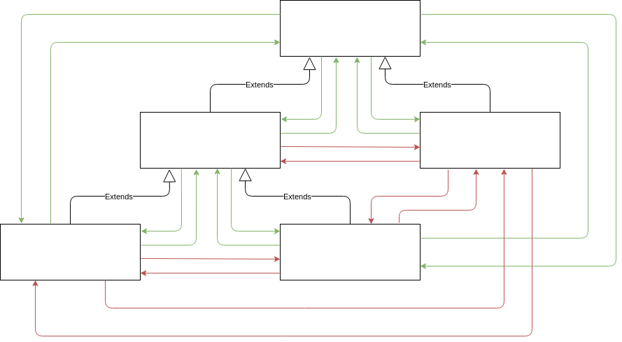

# Совместимость типов на основе вариантности

## Совместимость типов на основе вариантности

Помимо того, что совместимость типов зависит от вида типизации, которая была подробно разобрана в главе [“Экскурс в типизацию - Совместимость типов на основе вида типизации”](), она также может зависть от такого механизма, как вариантность.

_Вариантность_ — это механизм переноса иерархии наследования типов на производные от них типы. В данном случае производные не означает _связанные отношением наследования_. Производные, скорее, означает _определяемые теми типами, с которых переносится наследование_.

Если вы впервые сталкиваетесь с этим понятием, и определение вариантности кажется бессмысленным набором слов, то не стоит расстраиваться, эта тема очень простая, в чем вы сами скоро убедитесь.

В основе системы типов могут быть заложены следующие виды вариантности - _ковариантность_, _контрвариантность_, _инвариантность_, _бивариантность_. Кроме того, что система типов использует механизм вариантности для своих служебных целей, она также может предоставлять разработчикам возможность управлять им зависящими от конкретного языка способами.

Но прежде, чем познакомится с каждым из этих видов вариантности отдельно, стоит сделать некоторые уточнения, касательно иерархии наследования.

## Иерархия наследования

_Иерархия наследования_ — это дерево, вверху которого расположен _корень_, самый _базовый тип_ (_менее конкретный тип_), ниже которого располагаются его _подтипы_ (_более конкретные типы_). В случаях преобразования подтипа к базовому типу говорят, что выполняется _восходящее преобразование_ (_upcasting_). И наоборот, когда выполняется приведение базового типа к его подтипу, говорят, что выполняется _нисходящее приведение_ (_downcasting_). Отношения между супертипом и его подтипом описываются, как отношение _родитель-ребенок_ (parent-child). Отношения между родителем типа и его ребенком описываются, как _предок-потомок_ (ancestor-descendant). Кроме того, при логическом сравнении, тип, находящийся выше по дереву, больше (`>`), чем тип, находящийся ниже по дереву. И наоборот. Можно сказать, что `parent > child`, `child < parent`, `ancestor > descendant`, `descendant < ancestor`. Все это представлено на диаграмме ниже.

Этого вполне достаточно для того, чтобы приступить разбору вариантности, точнее её видов.

## Ковариантность

_Ковариантность_ — это механизм, позволяющий использовать более конкретный тип там, где изначально предполагалось использовать менее конкретный тип. Простыми словами, совместимыми считаются типы имеющие отношение `A > B` и `A = B`.

Ковариантность не рекомендуется в местах допускающими запись. И чтобы понять смысл этих слов, ниже представлена диаграмма, которая иллюстрирует, как через базовый тип можно добавить в массив с подтипом, другой несовместимый подтип и тем самым нарушить типобезопасность программы.

Ковариантность рекомендуется применять в местах допускающих чтение.

## Контрвариантность

_Контвариантность_ — это противоположный ковариантности механизм, позволяющий использовать менее конкретный тип там, где изначально предполагалось использовать более конкретный тип. Другими словами, совместимыми считаются типы имеющие отношения `A < B` и `A = B`.

Контрвариантность не рекомендуется в местах допускающих чтение. И наоборот, рекомендуется применять в местах допускающих запись.

## Инвариантность

_Инвариантность_ — это механизм, позволяющий использовать только заданный тип. Совместимыми считаются только идентичные типы `A = A`.

## Бивариантность

_Бивариантность_ — это механизм, который является представлением всех, перечисленных ранее, видов вариантности. В его случае совместимыми считаются любые из перечисленных ранее варианты типы `A > B`, `A < B` и `A = B`.

Бивариантность является самым нетипобезопасным видом вариантности.
